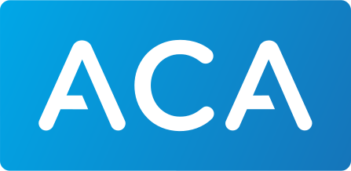

 

# ACA

<a href="https://www.aca.nl/" target="_blank">ACA</a> <i class="fa fa-external-link" style="font-size:12px;color:#8b929e"></i> supports automatic refunds with your MultiSafepay account.

For more information, see ACA – <a href="https://www.aca.nl/xprt/acties/refund-afletteren.html" target="_blank">Refund reconciliation</a> <i class="fa fa-external-link" style="font-size:12px;color:#8b929e"></i>.

To reconcile the refund automatically with your MultiSafepay account, see ACA - <a href="https://www.aca.nl/contact/" target="_blank">Contact</a> <i class="fa fa-external-link" style="font-size:12px;color:#8b929e"></i>

---

 

# Actuals

<a href="https://actuals.io/" target="_blank">Actuals</a> <i class="fa fa-external-link" style="font-size:12px;color:#8b929e"></i> imports new transactions daily, between 02:00 AM and 05:00 AM (CET/CEST).

How to integrate

 

To connect your Actuals account to your MultiSafepay account:

1. Sign in to your <a href="https://live.actuals.io" target="_blank">Actuals account</a> <i class="fa fa-external-link" style="font-size:12px;color:#8b929e"></i>.
2. Go to **Configuration**.
3. Under **Payment service provider** > **MultiSafepay**, click **Add**.
4. In the **Configuration name** field, rename the configuration, if relevant.
5. In the **MultiSafepay API Key** field, enter your MultiSafepay [site API key](/docs/sites#site-id-api-key-and-security-code), and then click **Save**.
6. To check the connection, go to **Configuration**.
7. Under **In-use sources**, check that the **Status** of your MultiSafepay configuration is **Live**.

 

---

 

# AFAS

<a href="https://www.afas.nl/" target="_blank">AFAS</a> <i class="fa fa-external-link" style="font-size:12px;color:#8b929e"></i> supports MultiSafepay [accountant exports](/docs/reports#accountant-export) (MT940 format).

For import instructions, see AFAS – <a href="https://www.afas.nl/contact" target="_blank">Contact</a> <i class="fa fa-external-link" style="font-size:12px;color:#8b929e"></i>.

### Forque
For generating automated accounting reports, see Forque – <a href="https://www.forque.nl/afas-consultancy" target="_blank">AFAS</a> <i class="fa fa-external-link" style="font-size:12px;color:#8b929e"></i>.

### De Viske ICT
For middleware solutions to automate processes and efficiently exchange data between AFAS and other applications, see De Viske ICT – <a href="https://deviske.nl/applicaties/" target="_blank">Applicaties</a> <i class="fa fa-external-link" style="font-size:12px;color:#8b929e"></i>.

 

---

 

# e-Boekhouden

<a href="https://www.e-boekhouden.nl/koppelingen/payment-service-providers/multisafepay?qsm=387" target="_blank">e-Boekhouden</a> <i class="fa fa-external-link" style="font-size:12px;color:#8b929e"></i> supports MultiSafepay [accountant exports](/docs/reports#accountant-export) (MT940 or CSV format).

For import instructions, see e-Boekhouden – <a href="https://www.e-boekhouden.nl/contact" target="_blank">Contact</a> <i class="fa fa-external-link" style="font-size:12px;color:#8b929e"></i>.

To add MultiSafepay [payment links](/docs/payment-links/) to e-Boekhouden invoices to let customers pay directly, see e-Boekhouden – <a href="https://secure.e-boekhouden.nl/bh/kb.asp?ACTION=SHOW&ID=237&POPUP=1" target="_blank">How do I insert a payment link or image in my invoices</a> <i class="fa fa-external-link" style="font-size:12px;color:#8b929e"></i>.

### PSP Betalingen integration

PSP Betalingen has developed an integration that connects your MultiSafepay account to e-Boekhouden, continually importing your transactions so you can automate reconciliation.

For more information, see PSP Betalingen – <a href="https://www.webwinkelfacturen.nl/koppelingpsp.php?shopsystem=multisafepay&invoicesystem=eboekhouden" target="_blank">Koppeling MultiSafepay e-Boekhouden</a> <i class="fa fa-external-link" style="font-size:12px;color:#8b929e"></i>.

To connect your MultiSafepay account to e-Boekhouden, see PSP betalingen – <a href="https://handleidingen.pspbetalingen.nl/handleiding-multisafepay-eboekhouden" target="_blank">Handleiding: MultiSafepay e-Boekhouden</a> <i class="fa fa-external-link" style="font-size:12px;color:#8b929e"></i>. (You will need a MultiSafepay [site API key](/docs/sites#site-id-api-key-and-security-code).)

 

---

 

# Exact

<a href="https://www.exact.com/nl" target="_blank">Exact</a> <i class="fa fa-external-link" style="font-size:12px;color:#8b929e"></i> Globe and Online can integrate with MultiSafepay directly to export relevant transaction data via their API, or you can manually export MultiSafepay [accountant exports](/docs/reports#accountant-export) (MT940 format). 

### Automated exports

How to automate exports with Exact Online 

 

To grant MultiSafepay permission to access your Exact Online account:

1. Sign in to your <a href="https://merchant.multisafepay.com" target="_blank">MultiSafepay dashboard</a> <i class="fa fa-external-link" style="font-size:12px;color:#8b929e"></i>.
2. Go to **Reports** > **Accounting integrations** > **Exact Online** > **Configure**.  
   You are redirected to Exact Online. 
3. Enter your email address and Exact Online password, and then click **Next**.  
   A list of required permissions is displayed.
4. Grant MultiSafepay access to Exact Online only or Exact Online and future companies. 
5. Select the checkbox to accept the Exact Online terms and conditions.
6. Click **Allow**.  
   You are redirected to your MultiSafepay dashboard.  
   ✅   You have successfully granted MultiSafepay access permissions.

❗️If you delete or modify information in Exact Online, exports will fail. If you encounter an error, email [support@multisafepay.com](mailto:support@multisafepay.com)

How to link ledger accounts

 

1. In the **Exact Online code** field:

- Click the **dropdown** icon and then select the relevant code, **or**
- Enter the code or name to search for the relevant code.

2. Once all accounts are linked, click **Submit**.

***

To edit the existing ledger account:

1. Click the **Pencil** icon next to the **Exact Online code** field.
2. In the **Exact Online code** field, click the **dropdown** icon and then select the relevant code.
3. Click **Submit**.

***

To create your own ledger account:

1. Click **+ **  next to the **Exact Online code** field.
2. In the **Exact Online code** field, enter your **Code** and **Description**.
3. Click ✔.

***

How to schedule automated exports

 

1. In your dashboard, under **Schedule export**, toggle the **Enabled/Disabled** radio button to **Enabled**.
2. Click **Save**.  
   ✅   The scheduled export appears below. 

- Exports start the day **after** you set the schedule. 
- You can only have 1 scheduled export queued at a time.
- You can view the status of previous exports under **Export history**. If exports are failing, email [support@multisafepay.com](mailto:support@multisafepay.com)
- Export data for a specified time period **once only** to avoid duplicate data in Exact.  

***

To enable/disable exports:

In your dashboard, under **Schedule export**, toggle the **Enabled/Disabled** radio button as needed.

❗️You must add the data for periods when exports are disabled to Exact Online **manually**, otherwise it is lost.

### Financial year

How to add a new financial year 

 

1. Sign in to your Exact Online account.
2. On the navigation menu > click  **sample company Exact online** > **Master Data**.
3. Under **Financial** > select **Period-data table**.
4. Under **Financial years** page > click on **New** >  **Create**   Create new financial year pop-up screen appears.
5. Click **Close**.

❗️You must add the financial year to Exact Online every year. Otherwise, your exports will fail.

### Manual imports

Prerequisites

 

- Exact Basic / Standard package does **not** support the MT940 import function. You need at least Exact Advanced.  
- Lightspeed users must request Lightspeed to make an adjustment to make sure order numbers appear in the correct fields in Exact Online to successfully match the MultiSafepay MT940.
- Exact Globe and Exact Online both import and match MultiSafepay MT940 reports provided that:
  - Your accounting package can process MT940 files.
  - The order numbers in the MT940 files also appear in the correct invoice fields in your accounting platform.
  - The customer's name and order amounts that appear in the exported MT940 files match your accounting platform.

***

How to import manually

 

1. Provide Exact with an additional international bank account number (IBAN). This can be a dummy (placeholder) IBAN. 

   - Go to IBAN Calculator – <a href="https://www.ibancalculator.com/bic_und_iban.html" target="_blank">Calculate an IBAN</a> <i class="fa fa-external-link" style="font-size:12px;color:#8b929e"></i>. 
   - From the **Country** list, select **The Netherlands**.
   - Under **Bank Code**, enter a bank, e.g. ING Group.
   - In the **Account number** field, enter any 7 digits.
   - Click **Calculate IBAN**.  
     A dummy IBAN and BIC code are generated.

2. Submit the IBAN to the relevant platform:

   **Exact Globe**

   - Sign in and go to **Bank accounts**.
   - Click **New**.
   - Under **Type**, select **Payment service provider**. 
   - Enter the dummy IBAN and select the same bank as before, e.g. ING Group.
   - Click **Save**.  
     You can now register all transactions linked to this IBAN.

   **Exact Online**

   - Sign in and go to **Financial** > **Banking & Cash** > **Bank accounts** > **Overview**.
   - Click **New**.
   - Enter your dummy IBAN, and then click **Save**.  
     You can now register all transactions linked to this IBAN.

3. Export a MT940 accountant export from your MultiSafepay dashboard.

   - Sign in to your <a href="https://merchant.multisafepay.com" target="_blank">MultiSafepay dashboard</a> <i class="fa fa-external-link" style="font-size:12px;color:#8b929e"></i>.
   - Go to **Reports** > **Accountant export**:  
     - From the **Date selection** list, select a date range.
     - From the **Currency** list, select the currency. 
     - From the **Report type** list, select **MT940**.
   - For the **Group costs in 1 record** toggle, set to:   
     - **Yes:** Show only the total of all MultiSafepay transaction fees for the selected timeframe.
     - **No:** List each MultiSafepay fee below the matching transaction.
   - Click **Advanced options:**
     - In the **Bank Account / IBAN** field, enter the dummy IBAN.
     - In the **BIC** field, enter the dummy BIC code.

4. Import the MT940 accountant export into Exact Online.

   - Sign in to your Exact Online account.
   - Go to **Financial** > **Banking & Cash** > **Statements** > **Import**.
   - Click **Choose File**, and then select the MT940 file you want to upload.
   - Click **Import**.

***

### Denovit integration

<a href="https://www.denovit.nl/" target="_blank">Denovit</a> <i class="fa fa-external-link" style="font-size:12px;color:#8b929e"></i> automates payment link into Exact invoices.

How to set up Denovit

 

1. Sign in to your Denovit account.
2. Go to your **Dashboard**, and then select the **Paylink** module. 
3. Connect to your Exact account.
4. Under **PSP settings**, enter your [MultiSafepay API key](/docs/sites#site-id-api-key-and-security-code) and the payment conditions you use in Exact. 
5. Adjust other settings as relevant, e.g. personalize your email template, thank-you page, or notification email to improve customer experience.

For each new invoice in Exact, if you:

- **Email:** The customer receives a second email containing a payment link, in addition to the normal email.
- **Print and process:** The customer receives an email containing a payment link.

***

To add MultiSafepay [payment links](/docs/payment-links/) into Exact invoices, see Denovit – <a href="https://www.denovit.nl/exact-cashflow" target="_blank">Payment link module</a> <i class="fa fa-external-link" style="font-size:12px;color:#8b929e"></i>.

### xCore integration

xCore offers two reconciliation apps that retrieve all payment details from MultiSafepay for the day and automatically match each payment with its corresponding open item in Exact.

For more information, see xCore – <a href="https://xcore.nl/afletteren-2-0-exact-online-multisafepay/" target="_blank">Afletteren 2.0 Exact Online with MultiSafepay</a> <i class="fa fa-external-link" style="font-size:12px;color:#8b929e"></i>.

***

# King Business Software

<a href="https://www.kingconnections.eu/MultiSafePay" target="_blank">King Business Software</a> <i class="fa fa-external-link" style="font-size:12px;color:#8b929e"></i> supports MultiSafepay [accountant exports](/docs/reports#accountant-export) (MT940 format).

For import instructions, see King Business Software – <a href="https://service.king.eu" target="_blank">Service</a> <i class="fa fa-external-link" style="font-size:12px;color:#8b929e"></i>.

 

---

 

# Octopus

<a href="https://www.octopus.be/" target="_blank">Octopus</a> <i class="fa fa-external-link" style="font-size:12px;color:#8b929e"></i> supports MultiSafepay [accountant exports](/docs/reports#accountant-export) (CODA format).

For import instructions, see Octopus – <a href="https://www.octopus.be/nl/handleiding/coda-verwerking" target="_blank">Coda verwerking</a> <i class="fa fa-external-link" style="font-size:12px;color:#8b929e"></i> > C. CODA aangeleverd door derden. 

 

---

 

# SnelStart

<a href="https://www.snelstart.nl" target="_blank">SnelStart</a> <i class="fa fa-external-link" style="font-size:12px;color:#8b929e"></i> supports MultiSafepay [accountant exports](/docs/reports#accountant-export) (MT940 format).

For import instructions, see SnelStart – <a href="https://www.snelstart.nl/klantenservice" target="_blank">Klantenservice</a> <i class="fa fa-external-link" style="font-size:12px;color:#8b929e"></i>.

To add MultiSafepay [payment links](/docs/payment-links/) to SnelStart invoices to let customers pay directly, see SnelKoppeling – <a href="https://snelkoppeling.eu/productoverzicht/boekhoudtechnisch/emailplus" target="_blank">Betaallinks via payment service provider</a> <i class="fa fa-external-link" style="font-size:12px;color:#8b929e"></i>.

### Premarc plugins

<a href="https://www.snelkoppeling.eu/productoverzicht/webwinkelkoppelingen" target="_blank">Premarc</a> <i class="fa fa-external-link" style="font-size:12px;color:#8b929e"></i> offers plugins to reconcile SnelStart with popular ecommerce platforms.

Supported ecommerce platforms

 

- <a href="https://www.snelkoppeling.eu/ccvshop" target="_blank">CCVshop</a> <i class="fa fa-external-link" style="font-size:12px;color:#8b929e"></i>
- <a href="https://www.snelkoppeling.eu/lightspeed" target="_blank">Lightspeed</a> <i class="fa fa-external-link" style="font-size:12px;color:#8b929e"></i>
- <a href="https://www.snelkoppeling.eu/magento" target="_blank">Magento</a> <i class="fa fa-external-link" style="font-size:12px;color:#8b929e"></i>
- <a href="https://www.snelkoppeling.eu/shopify" target="_blank">Shopify</a> <i class="fa fa-external-link" style="font-size:12px;color:#8b929e"></i>
- <a href="https://www.snelkoppeling.eu/woocommerce" target="_blank">WooCommerce</a> <i class="fa fa-external-link" style="font-size:12px;color:#8b929e"></i>

 

---

 

# Twinfield

<a href="https://taxnl.wolterskluwer.com/" target="_blank">Twinfield</a> <i class="fa fa-external-link" style="font-size:12px;color:#8b929e"></i> supports MultiSafepay [accountant exports](/docs/reports#accountant-exports) (MT940 format). 

You must first provide Twinfield with an additional international bank account number (IBAN). This can be a dummy (placeholder) IBAN.

How to generate dummy IBANs

 

1. Go to IBAN Calculator – <a href="https://www.ibancalculator.com/bic_und_iban.html" target="_blank">Calculate an IBAN</a> <i class="fa fa-external-link" style="font-size:12px;color:#8b929e"></i>. 
2. From the **Country** list, select **The Netherlands**.
3. Under **Bank Code**, enter a bank, e.g. ING Group.
4. In the **Account number** field, enter any 7 digits.
5. Click **Calculate IBAN**.  
    A dummy IBAN and BIC code are generated.
---

How to import

 

1. Sign in to your Twinfield account.
2. From the menu, select **Cash & Banks**, and then select **Cash & Banks** again.
3. In the **Code** line, enter an identifier (e.g. MSPAY), and then click **Next**.
4. Fill the following fields:
- **Account name**
- **Account number**
- **BIC**
- **General ledger account**
- **IBAN**
7. In **Cash & Banks**, select **Drag and drop bank statements** or **Browse**.
8. Upload the MultiSafepay MT940 file.
---

✅ &nbsp; **Tip!** For a free 30-day trial including all accounting functions, see Twinfield – <a href="https://www.wolterskluwer.com/nl-nl/solutions/twinfield-accounting/twinfield-boekhouden-probeer-nu" target="_blank">Proef abonnement aanvragen</a> <i class="fa fa-external-link" style="font-size:12px;color:#8b929e"></i>.

 

---

 

# Unit4

<a href="https://accountancygemak.nl/" target="_blank">Unit4</a> <i class="fa fa-external-link" style="font-size:12px;color:#8b929e"></i> supports MultiSafepay [accountant exports](/docs/reports#accountant-export) (MT940 format).

For import instructions, see Unit4 – <a href="https://accountancygemak.nl/support/" target="_blank">Support</a> <i class="fa fa-external-link" style="font-size:12px;color:#8b929e"></i>.

 

---

 

# Visma

<a href="https://nl.visma.com/" target="_blank">Visma</a> <i class="fa fa-external-link" style="font-size:12px;color:#8b929e"></i> supports MultiSafepay [accountant exports](/docs/reports#accountant-export) (MT940 and CAMT053 formats).

For import instructions, see Visma – <a href="https://nl.visma.com/accountview-support/contact" target="_blank">Contact</a> <i class="fa fa-external-link" style="font-size:12px;color:#8b929e"></i>.

 

---

 

# Yuki

<a href="https://www.yuki.nl/nl/" target="_blank">Yuki</a> <i class="fa fa-external-link" style="font-size:12px;color:#8b929e"></i> supports MultiSafepay [accountant exports](/docs/reports#accountant-export) (MT940 format).

How to import

 

1. Sign in to your Yuki domain ending in **@yukiworks.be**.
2. Go to **Yuki Postbus** > **Submit**.
3. Click **Upload**, and select the relevant MT940 file, or choose one of the other upload methods.

For more information, see Yuki - <a href="https://support.yuki.nl/en/support/solutions/articles/80000786497-upload-files-from-po-box" target="_blank">Upload files from PO box</a> <i class="fa fa-external-link" style="font-size:12px;color:#8b929e"></i>.

---

How to reconcile automatically using bank recognition rules

 

1. Go to **Bank transactions to be processed** > **(New) Processing rule**.
2. Create a new rule. 

For more information, see Yuki - <a href="https://support.yuki.nl/nl/support/solutions/articles/80000787813-bank-verwerkingsregel-aanmaken" target="_blank">Create bank processing rule</a> <i class="fa fa-external-link" style="font-size:12px;color:#8b929e"></i>.

---

### Duopact integration

<a href="https://www.duopact.nl/nl/yuki-koppelingen/onze-koppelingen/multisafepay/" target="_blank">Duopact</a> <i class="fa fa-external-link" style="font-size:12px;color:#8b929e"></i> imports MultiSafepay transactions automatically daily at midnight.

How to integrate

 

To connect Duopact with your MultiSafepay account, see Duopact – <a href="https://www.duopact.nl/nl/contact/" target="_blank">Contact</a> <i class="fa fa-external-link" style="font-size:12px;color:#8b929e"></i>.  

Provide Duopact with your MultiSafepay [site API key](/docs/sites#site-id-api-key-and-security-code). They will set up a Yuki account for you. 

---

How to manually import transactions

 

1. Sign in to your <a href="https://portal.yukiconnector.nl/" target="_blank">Duopact account</a> <i class="fa fa-external-link" style="font-size:12px;color:#8b929e"></i>.
2. If you operate multiple sites, select the relevant site from the top-left menu.
3. Go to **Bankmutaties** > **MultiSafepay**.
4. Click the green button under the **Status** tab.

📘 **Note:** Manually importing transactions doesn't affect automatic imports.

 

---

[block:html]
{
  "html": "<blockquote class=\"callout callout_info\">\n    <h3 class=\"callout-heading false\">\n        💬\n        
Support
\n    </h3>\n    
Email <a href=\"mailto:integration@multisafepay.com\">integration@multisafepay.com</a>
\n</blockquote>\n"
}
[/block]

[Top of page](#)
